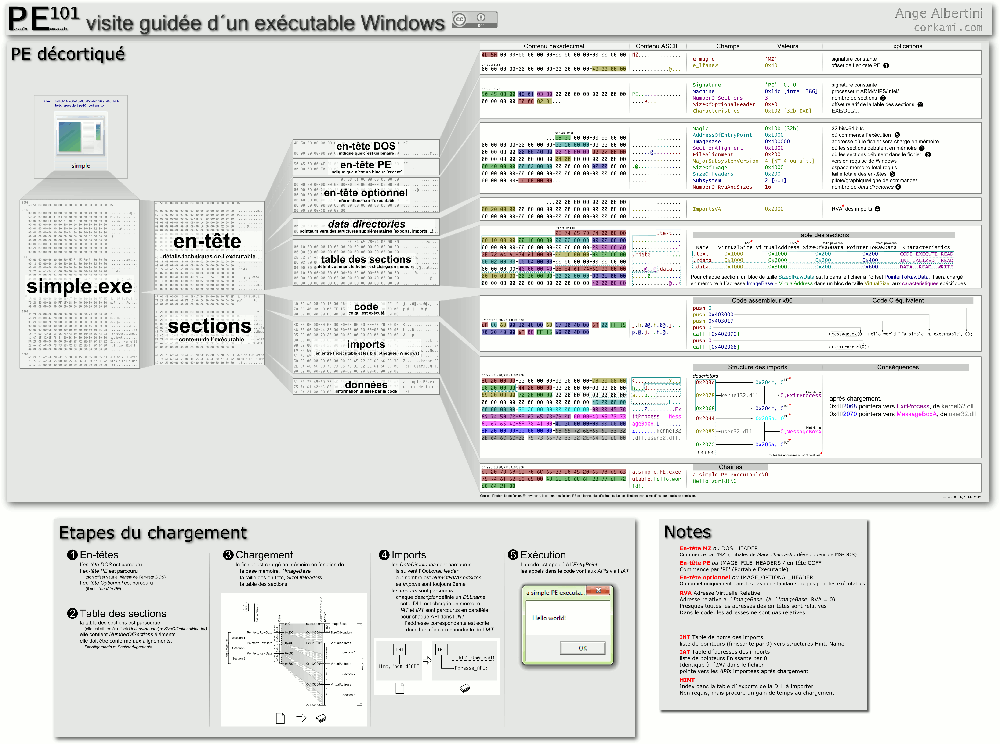
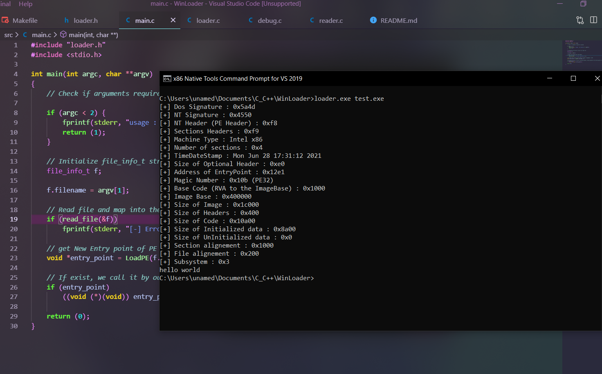

# WinLoader
Simple custom PE Loader

Documentation : 
https://fr.wikipedia.org/wiki/Portable_Executable
https://stackoverflow.com/questions/41581363/how-we-can-get-hint-in-image-import-by-name-struct-in-pe-file
https://docs.microsoft.com/en-us/windows/win32/api/winnt/ns-winnt-image_section_header
https://docs.microsoft.com/en-us/windows/win32/api/winnt/ns-winnt-image_optional_header64
https://docs.microsoft.com/en-us/windows/win32/api/winnt/ns-winnt-image_file_header
https://docs.microsoft.com/en-us/windows/win32/debug/image-access-functions (without Read file in memory)
http://www.asmcommunity.net/forums/topic/?id=28027
https://stackoverflow.com/questions/31981929/what-is-the-base-relocation-table-in-the-pe-file-format
https://stackoverflow.com/questions/2170843/va-virtual-address-rva-relative-virtual-address
https://lief.quarkslab.com/

Adresses Physique, virtuel et mémoire
La première chose à savoir est que l'exécutable est chargé en mémoire à l'adresse ImageBase (présent dans OptionalHeader) si cette adresse est disponible. Sinon il est chargé à une autre adresse qui sera la nouvelle valeur ImageBase.

Dans l'en-tête et le corps d'un fichier PE, on trouve trois adressages différents :

Les adresses physiques représentent une position dans le fichier. Dans l'en-tête, leur nom commence par PointerTo
Les adresses virtuelles indiquent une position en mémoire relative à ImageBase. Dans l'en-tête, leur nom commence par Virtual
Les adresses mémoire sont aussi une position en mémoire mais cette fois absolue, ces adresses sont le plus souvent présentes dans le code de l'application et les données mais pas dans les en-têtes. Dans le cas où ImageBase a été modifié, la table des relocalisations indique la position des adresses mémoire à rectifier.

